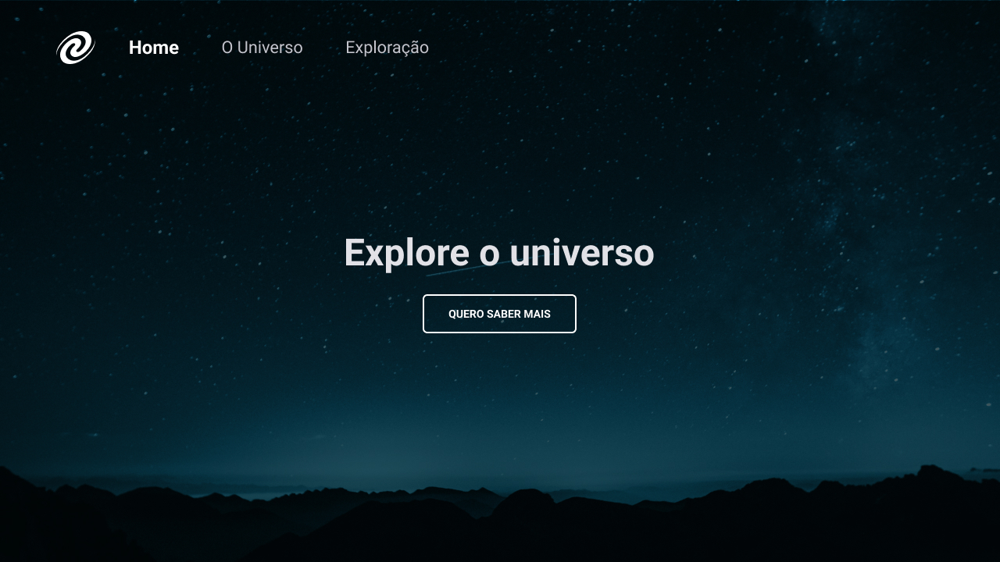

<h1 align="center"> Stage 06 - SPA Universe</h1>

 

  

## 🖥️ Tecnologias

Esse projeto foi desenvolvido com as seguintes tecnologias:

- HTML
- CSS
- Javascript
- Node
- Git e Github
- Figma

## 📂 Projeto

 Neste desafio a ideia é criar uma SPA abordando desta forma:

- Conceitos de SPA;
- Mapeamento de rotas;
- Assíncrono e promises;
- Orientação a objetos;
- Classes e muito mais.

 

## 🔖 Layout

Você pode visualizar o layout do projeto através [DESSE LINK](https://www.figma.com/file/m8zp3mtxvwyTGQs69nIFM8/%5BDesafios-Explorer%5D-SPA-Universe/duplicate). É necessário ter conta no [Figma](https://figma.com) para acessá-lo.

  

